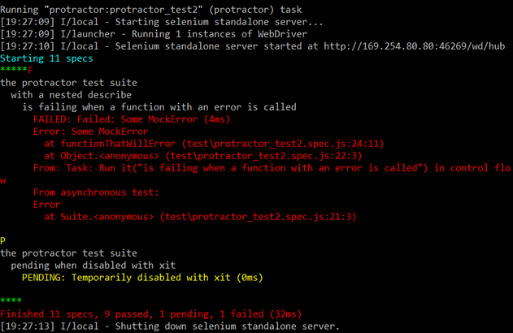

# karma-and-protractor-reporter

A command line reporter for protractor and karma for Test Driven Development.
The output is compact and has stacktrace highlighting so it's easy to see which
tests are failing as quickly as possible.

## How does it looks

The output looks similar in protractor or karma. The protractor stacktrace is
filtered (depending on options used) so that jasmine and protractor internals
are not shown.

## Installation

To install use `npm install karma-and-protractor-reporter --save-dev`.

### Karma Configuration

    // karma.conf.js
    module.exports = function(config) {
      config.set({
        frameworks: ['jasmine'],

        // reporters configuration
        reporters: ['mocha'],
        kap: {
          useColors: true,
          showTiming: true,
          style: 'dots',
          stackStyle: 'summary'
        }
      });
    };

### Protractor Configuration

    // protractor.conf.js
    exports.config = {
      jasmineNodeOpts: {
        print: function() {}
      },
      onPrepare: function() {
        var KapReporter = require('karma-and-protractor-reporter').KapReporter;
        jasmine.getEnv().addReporter(new KapReporter({
          useColors: true,
          showTiming: true,
          style: 'dots',
          stackStyle: 'summary'
        }));
      }
    };

## Options

### addSpacing
**Type:** Boolean _default_ `true`

Set to true to add a new line between tests.

### colors
**Type:** Object _default_

The following colors are used by default for more options refer to **marak/colors.js** documentation.

    {
      passed: ['green', 'bold'],
      failed: ['red', 'bold'],
      pending: ['yellow', 'bold'],
      other: ['cyan', 'bold'],
      base: ['reset'],
      stack: ['red'],
      stackHighlight: ['red', 'bold']
    }

### failDot
**Type:** String _default_ `'F'`

If using 'dots' style, this character will be used for each failing test.

### indent
**Type:** String _default_ `'  '`

This can be changed to override the indentation size.

### passDot
**Type:** String _default_ `'*'`

If using 'dots' style, this character will be used for each passing test.

### pendingDot
**Type:** String _default_ `'P'`

If using 'dots' style, this character will be used for each pending test.

### showId
**Type:** Boolean _default_ `false`

If set a test id will be displayed beside each test.

### showPassed
**Type:** String _default_ `false`

Show the description of each passing test.
_Not available with 'compact' style._

### showPending
**Type:** Boolean _default_ `true`

Show the description of each pending test.
_Not available with 'compact' style._

### showFailed
**Type:** Boolean _default_ `true`

Show the description of each failed test.
_Not available with 'compact' style._

### showTiming
**Type:** Boolean _default_ `true`

Show how long each test took to run.

### stackStyle
**Type:** String _default_ `'summary'`

stacktraces can be highlighted or abbreviated to help you get to the failing
code more quickly.

  * `'summary'` less important info is removed from the stacktrace.
  * `'highlight'` most important info is hightlighted in the stacktrace.
  * `'default'` the stacktrace is not altered.
  * `'none'` no stacktrace is shown.

### style
**Type:** String _default_ `'dots'`

The overall display can be altered.

  * `'dots'` same as normal but a character is displayed for each test runs.
  * `'compact'` a more compact view of all the tests that have execute.
  * `'normal'` each test renders its outcome. _(see 'showPassed', 'showPending', 'showFailed')_

### useColors
**Type:** Boolean _default_ `true`

Use colors in the output.

